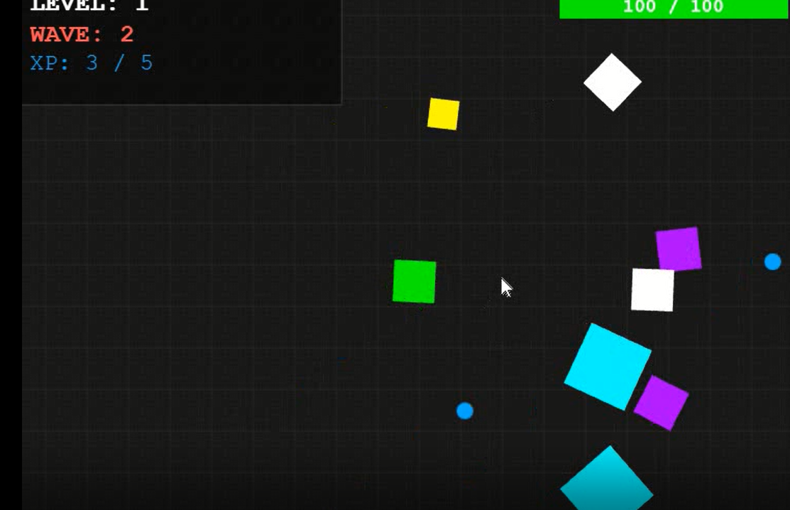
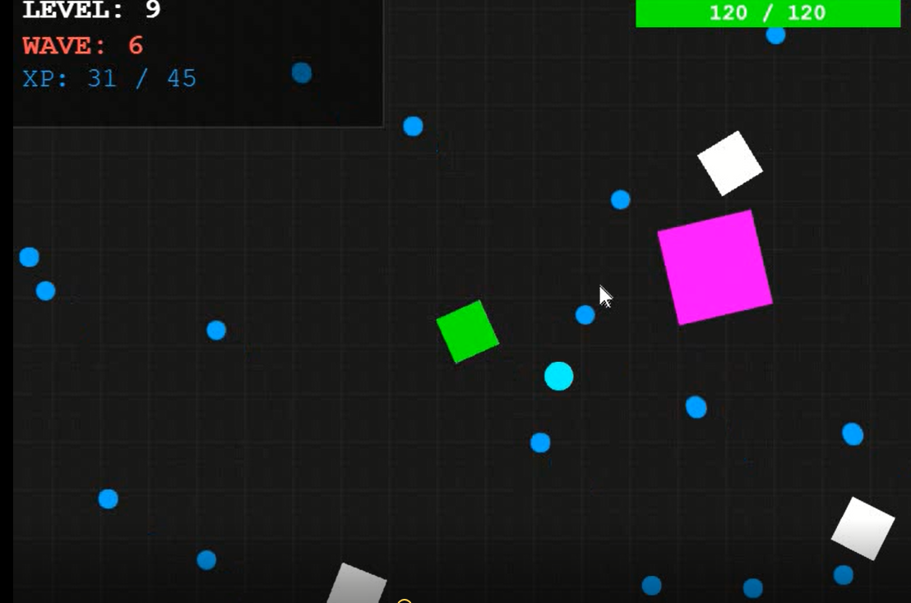
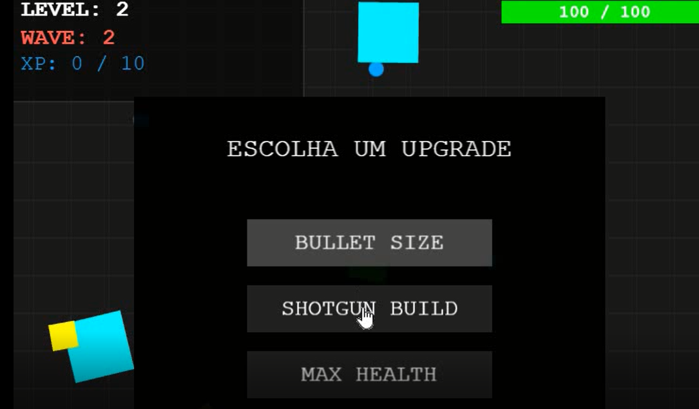

# Phaser Survival Framework

# Phaser Survival Framework

A modular Phaser 3 framework for building Vampire Survivors-style games.

## Download

Available on Itch.io:

https://nanoboltis.itch.io/phaser-survival-framework

---

A modular Phaser 3 framework designed for building Vampire Survivors-style games, arena shooters and survival experiences.

The framework provides a complete gameplay foundation, including combat, progression, enemies, bosses, waves and object pooling systems.

Ideal for developers who want to accelerate development and focus on creating content instead of rebuilding core gameplay systems from scratch.

## Features

✔ Modular Architecture

✔ Weapon System

✔ Upgrade System

✔ XP & Leveling

✔ Wave System

✔ Enemy Variants

✔ Boss System

✔ Boss Wave Lock System

✔ Object Pooling

✔ Drone Companion

✔ HUD

✔ Game Over & Restart

## Built With

* Phaser 3
* JavaScript ES6
* Vite

---

## Project Structure

src/

├── combat/

├── core/

├── pooling/

├── upgrades/

├── waves/

├── ui/

├── scenes/

└── config/

---

## Included Systems

### Combat

* Automatic Shooting
* Multi Shot
* Attack Speed
* Projectile Scaling

### Enemies

* Normal Zombies
* Fast Zombies
* Tank Zombies
* Elite Zombies

### Bosses

* Tank Boss
* Boss Pooling
* Boss AI
* Boss Rewards

### Progression

* XP Collection
* Level Up
* Upgrade Selection
* Wave Progression

---

## Installation

npm install

npm run dev

npm run build

---

## Current Status

The framework is stable and ready for expansion.

Implemented:

* Boss System
* Wave System
* Upgrade System
* Enemy Pooling
* UI Framework

Planned:

* Additional Boss Types
* New Weapons
* Wave Rewards
* Advanced Difficulty Scaling

## Architecture Highlights

✔ Modular Systems

✔ Object Pooling

✔ Data Driven Enemy Configuration

✔ Upgrade Framework

✔ Boss Framework

✔ Wave Framework

✔ Reusable Components

---

## Screenshots

### Gameplay

### Boss Fight

### Upgrade Menu

## Development Videos

### YouTube

Boss System Implementation
https://youtu.be/tvsOiZuw7N0?si=U2JGTuNDPDtGsg91

### TikTok

Development Updates
https://www.tiktok.com/@claudiocjgdbm/video/7644957351887441172
## Documentation

* Architecture Overview
* How To Add Enemies
* How To Add Bosses
* How To Add Upgrades
* Changelog
* Roadmap

---

## License

Commercial use is allowed.

Games created with this framework may be sold commercially.

See LICENSE.md for

